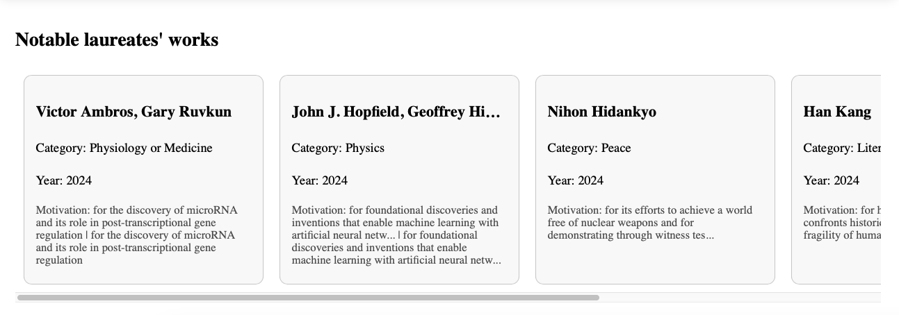

# Nobel-prize

# 노벨상 탐색기 (Nobel Prize Explorer)

**React 기반의 웹 애플리케이션**으로, 노벨상 수상자 정보를 직관적이고 사용하기 쉬운 인터페이스로 탐색할 수 있도록 설계되었습니다. 이 프로젝트는 사용자 경험을 향상시키고, 노벨상 데이터를 필터링하고 시각화하며, 현대적이고 모듈화된 프론트엔드 애플리케이션 개발에 초점을 맞추고 있습니다.

---

## 📜 **목차**

- [Nobel-prize](#nobel-prize)
- [노벨상 탐색기 (Nobel Prize Explorer)](#노벨상-탐색기-nobel-prize-explorer)
  - [📜 **목차**](#-목차)
  - [🎯 **프로젝트 목표**](#-프로젝트-목표)
  - [✨ **주요 기능**](#-주요-기능)
    - [사용자 인터페이스](#사용자-인터페이스)
    - [에러 처리](#에러-처리)
    - [라우팅](#라우팅)
  - [🛠️ **사용 기술**](#️-사용-기술)
  - [🚀 **시작하기**](#-시작하기)
    - [사전 준비](#사전-준비)
    - [설치 방법](#설치-방법)
  - [🗂️ **프로젝트 구조**](#️-프로젝트-구조)
  - [📖 **사용 방법**](#-사용-방법)
  - [🖼️ **이미지 프리뷰**](#️-이미지-프리뷰)
    - [카테고리 선택 화면](#카테고리-선택-화면)
  - [🛠️ **향후 개선 사항**](#️-향후-개선-사항)

---

## 🎯 **프로젝트 목표**

1. **교육적 자료 제공**: 학생, 연구자, 일반 사용자들에게 노벨상 정보를 쉽게 제공.
2. **데이터 중심 개발**: [노벨상 API](https://nobelprize.readme.io/)를 활용해 실시간 데이터를 기반으로 동작하는 애플리케이션 개발.
3. **UI/UX 향상**: 시각적으로 매력적이고 반응형 인터페이스 구현.
4. **확장 가능한 코드베이스**: 모듈화와 재사용 가능한 컴포넌트 구조를 통해 향후 기능 추가 용이.

---

## ✨ **주요 기능**

### 사용자 인터페이스

- **카테고리 선택**: 의학, 물리학, 화학, 평화, 문학, 경제학 등 노벨상 카테고리를 인터랙티브한 그리드 인터페이스로 탐색.
- **동적 데이터 로드**: 선택된 카테고리의 노벨상 수상자 정보를 실시간으로 로드.
- **이미지 통합**: 각 카테고리에 적합한 이미지를 추가해 시각적 매력 강화.
- **반응형 디자인**: 데스크탑, 태블릿, 모바일 디바이스에 최적화.

### 에러 처리

- API 또는 네트워크 오류 발생 시도 사용자 경험을 해치지 않도록 안정적인 에러 처리.

### 라우팅

- **React Router**를 활용해 부드럽고 직관적인 페이지 간 탐색 제공.

---

## 🛠️ **사용 기술**

- **React**: UI 구축을 위한 핵심 프레임워크.
- **React Router**: 페이지 간 탐색 관리.
- **CSS (반응형 디자인)**: 그리드 기반 레이아웃과 호버 효과를 포함한 맞춤 스타일링.
- **노벨상 API**: 동적 노벨상 데이터 제공.
- **Node.js** (옵션): 서버 로직이 필요한 경우 활용 가능.

---

## 🚀 **시작하기**

### 사전 준비

아래 항목이 사전에 설치되어 있어야 합니다:

- **Node.js**: [Node.js 다운로드](https://nodejs.org/)
- **npm 또는 yarn**: Node.js 설치 시 포함.

### 설치 방법

1. **레포지토리 클론**

   ```bash
   git clone https://github.com/your-username/nobel-prize-explorer.git
   cd nobel-prize-explorer
   ```

2. **필수 패키지 설치**

   ```bash
   npm install
   ```

3. **개발 서버 실행**

   ```bash
   npm start
   ```

4. **브라우저에서 실행**
   [http://localhost:3000](http://localhost:3000)으로 이동.

---

## 🗂️ **프로젝트 구조**

```
nobel-prize-explorer/
├── public/
│   ├── images/               # 카테고리별 정적 이미지
│   │   ├── medicine.jpg
│   │   ├── physics.jpg
│   │   ├── chemistry.jpg
│   │   └── ...
│   └── index.html            # 메인 HTML 템플릿
├── src/
│   ├── components/           # React 컴포넌트
│   │   ├── Fields.js         # 카테고리 선택 그리드
│   │   ├── CategoryDetails.js # 카테고리별 상세보기
│   ├── styles/               # 스타일 파일
│   │   ├── Fields.css
│   │   └── ...
│   ├── App.js                # 메인 React 컴포넌트
│   ├── index.js              # 진입점
│   └── ...
└── README.md
```

---

## 📖 **사용 방법**

1. **카테고리 선택**: 메인 페이지에서 Physics 또는 Medicine과 같은 카테고리를 선택.
2. **상세 정보 탐색**: 해당 카테고리의 수상자 리스트를 확인. 데이터는 노벨상 API에서 실시간으로 가져옴.
3. **에러 처리**: API 또는 네트워크 오류가 발생해도 안정적인 인터페이스 유지.

---

## 🖼️ **이미지 프리뷰**

### 카테고리 선택 화면





---

## 🛠️ **향후 개선 사항**

1. **시각화 기능 강화**:
   - D3.js 또는 Chart.js와 같은 데이터 시각화 라이브러리를 사용하여 수상 트렌드, 국가별 데이터 등을 시각화.
2. **검색 기능 추가**:

   - 수상자 이름 또는 특정 키워드로 빠르게 탐색할 수 있는 글로벌 검색창 추가.

3. **다크 모드**:

   - 라이트 및 다크 테마 토글 기능 추가.

4. **접근성 개선**:

   - ARIA 속성 및 키보드 네비게이션 강화.

5. **테스트 도입**:
   - **Cypress** 또는 **React Testing Library**를 사용한 유닛 및 통합 테스트 추가.
